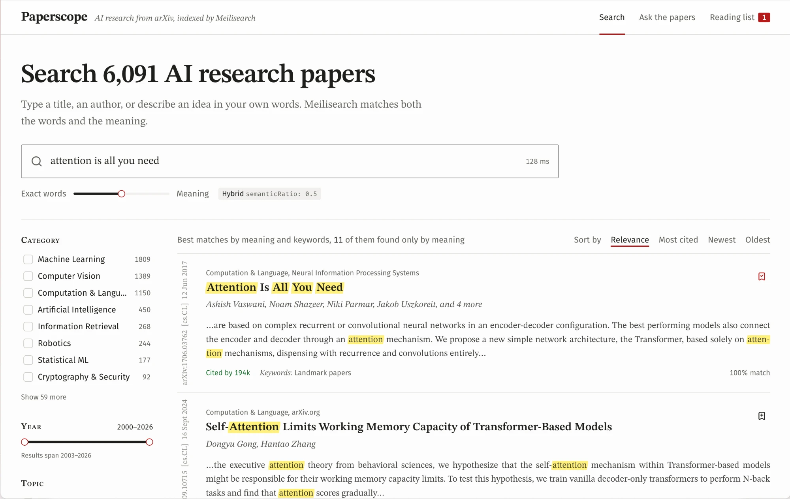

# Paperscope

Search, explore, and chat with ~6,000 AI research papers from arXiv, powered by Meilisearch.

**Live demo: [paperscope-one.vercel.app](https://paperscope-one.vercel.app)**



Type a title, an author, or describe an idea in your own words. Hybrid search matches both the exact
words and the meaning, every paper links to its nearest neighbours, and the chat page answers questions
from the whole corpus, your reading list, or a single paper, with sources.

## What it shows

| In the app | Meilisearch feature |
|---|---|
| Every search | **Hybrid search** (`hybrid.semanticRatio: 0.5`) with a HuggingFace embedder (`BAAI/bge-small-en-v1.5`) running inside Meilisearch |
| "11 of them found only by meaning" | `semanticHitCount` |
| "98% match" on each result, with how it was ranked on hover | `showRankingScore` and `showRankingScoreDetails` |
| "by meaning" badge | The hit's ranking details hold `vectorSort`: the embedding ranked it, not the keywords |
| "tranformer" still finds transformers | **Typo tolerance** |
| "LLM", "RAG", "LoRA"... | **Synonyms** |
| Category, topic, and author filters with counts | **Filters** and **facets** |
| Year range slider and "Results span 2003 to 2026" | `facetStats` |
| "Find an author..." box | **Facet search** |
| Sort by relevance, most cited, newest, oldest | **Sort**, plus the custom ranking rule `citationCount:desc` |
| Highlighted matches and abstract snippets | **Highlighting** and **cropping** |
| Author chips above the results | **Multi-search** (`papers` and `authors` indexes in one request) |
| "Similar papers" in the paper panel | **`/similar`** endpoint, optionally filtered to the same category |
| "Ask the papers" page | **Conversational search** (`/chats`): the LLM calls a hybrid search tool and streams progress and sources |
| Chat with your reading list or one paper | **Tenant token** whose search rule is `id IN [...]`, plus a system message telling the LLM which papers that is |

## Run it locally

Requires Docker (OrbStack) and Node 24.

```bash
cp .env.example .env               # add CHAT_API_KEY to enable the chat page
docker compose up -d meilisearch
cd web && pnpm install
pnpm data:fetch                    # arXiv + Semantic Scholar -> data/papers.json (~5 min)
pnpm data:setup                    # settings, embeddings, chat workspace, API keys (~15 min on CPU)
cd .. && docker compose watch      # web app with live sync
```

- App: http://web.research-papers.orb.local:3000 (or http://localhost:3100)
- Meilisearch: http://meilisearch.research-papers.orb.local:7700 (or http://localhost:7700), master key in `.env`

`pnpm data:setup` prints the search-only key. The one in `.env.example` already matches the default master key.

### Chat LLM

The `/chats` workspace needs an LLM provider. Set these in `.env`, then re-run `pnpm data:setup`
(documents are already indexed, so it is fast):

```bash
CHAT_SOURCE=openAi        # openAi | mistral | vLlm (vLlm for OpenAI-compatible gateways like LUMEN)
CHAT_API_KEY=sk-...
CHAT_MODEL=gpt-4o-mini
CHAT_BASE_URL=            # required for mistral (https://api.mistral.ai/v1) and vLlm
```

Without it, search and similar papers still work; only the chat page is disabled.

### Dataset size

`PER_TOPIC=50 RECENT_PER_CATEGORY=100 pnpm data:fetch` gives ~2,000 papers.
Topics and categories are listed in `web/scripts/fetch-arxiv.ts`.

## How it works

The browser queries Meilisearch directly with a search-only key: multi-search, `/similar`, and facet
search all live in `web/src/lib/search-api.ts`. The only server route that matters is
`/api/chat-token`, which signs a 30-minute tenant token so the browser can call `/chats` without ever
seeing the chat key. The token's search rules restrict the LLM to the papers in scope.

All Meilisearch configuration (indexes, settings, synonyms, embedder, chat workspace, keys) lives in
one script, `web/scripts/setup-meilisearch.ts`, and is safe to re-run.

```
compose.yaml                      meilisearch + web (Next.js dev server, compose watch)
data/papers.json                  fetched dataset (git-ignored)
web/scripts/fetch-arxiv.ts        dataset builder (arXiv API, Semantic Scholar citations and TL;DRs)
web/scripts/setup-meilisearch.ts  all Meilisearch configuration
web/src/lib/search-api.ts         browser-side search (search-only key)
web/src/app/api/chat-token        signs tenant tokens for /chats
web/src/app/api/status            health check
web/src/app/                      UI: search page, paper panel, chat page
```

## Production

| Piece | Where |
|---|---|
| Front | Vercel, team **meili**, project `paperscope`: https://paperscope-one.vercel.app |
| Meilisearch | Main instance on qdq-server (v1.54), `papers` and `authors` indexes, at `https://search.qdq.meilisearch.com` |
| Chat LLM | LUMEN on the same box, through its public URL `https://lumen.meilisearch.com/v1` as a `vLlm` source (so the system prompt is sent as a `system` message), model `claude-sonnet-5-5`, virtual key `paperscope-demo-chat` ($25 hard budget, 60 rpm) |

Two things worth knowing:

- Search is not proxied through Vercel. Caddy rate-limits per client IP, so a proxy would put every visitor in the same bucket.
- Meilisearch rejects private IPs such as `127.0.0.1` as a chat `baseUrl`, which is why LUMEN is reached through its public URL even though it runs on the same box.

Keys are created by `setup-meilisearch.ts` with fixed uids, so re-runs find them again:

| Key | uid | Actions | Indexes | Lives in |
|---|---|---|---|---|
| Paperscope search (public) | `7dbdf598-3e28-4236-9e10-3a5032b8ee19` | `search` | `papers`, `authors` | `NEXT_PUBLIC_MEILI_SEARCH_KEY` (browser bundle) |
| Paperscope chat (server) | `aaea7803-0890-4396-b0e5-1a630e1a3dc9` | `search`, `chatCompletions` | `papers` | `MEILI_CHAT_KEY` and `MEILI_CHAT_KEY_UID` (Vercel, server only) |

The LUMEN key is stored on the box in `/etc/meilisearch/paperscope-lumen-key.json` (0600) and in the
`papers` chat workspace settings.

### Re-import

Run the setup over an SSH tunnel, copying embeddings from your local instance so the box does not
compute them:

```bash
ssh -f -N -L 17700:127.0.0.1:7700 root@62.210.158.50
cd web
MEILI_HOST=http://localhost:17700 \
MEILI_MASTER_KEY="$(ssh root@62.210.158.50 'sed -n "s/^MEILI_MASTER_KEY=//p" /etc/meilisearch/meilisearch.env')" \
CHAT_API_KEY="$(ssh root@62.210.158.50 'python3 -c "import json;print(json.load(open(\"/etc/meilisearch/paperscope-lumen-key.json\"))[\"key\"])"')" \
CHAT_SOURCE=vLlm \
CHAT_BASE_URL=https://lumen.meilisearch.com/v1 \
VECTORS_FROM_HOST=http://localhost:7700 \
node scripts/setup-meilisearch.ts
```

### Deploy the front

```bash
cd web && vercel deploy --prod --scope meili
```
